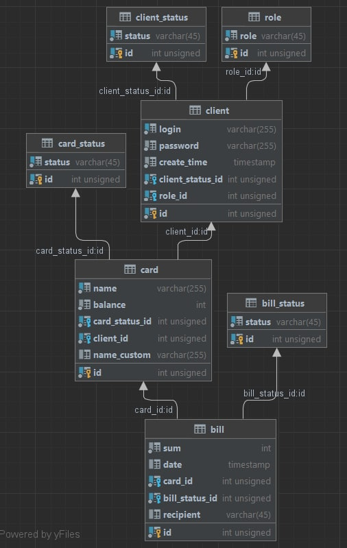
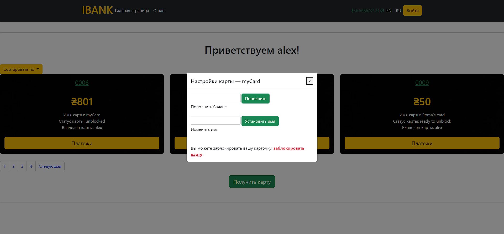

# My bank project

## Information

Payments is a web application written in Java. The payments is a platform where users can create personalized cards, manage them and make simple operations, for example, 
making payments, transferring to another card, and sorting bills and cards for fast finding needed cards. If you want to enter and try all of these functions, you have to 
log in or sign up before.

## Technologies

1. Java Core (Collections, Generics, Multithreading, Java 8).
2. Apache Tomcat 9 as servlet container.
3. To store data used relation database - MySQL.
4. For access to data used JDBC API and customized Connection Pool.
5. The application supports work with Cyrillic and Latin.
6. The application is a multilingual (ru and en).
7. Used design and enterprise patterns (MVC, DAO, Command, Factory, Singleton, Front Controller...).
8. JSP, Filters, Listeners, Session, JSTL (also developed own tags).
9. Data resubmission protection (PRG-pattern implemented).
10. Implemented an event log using log4j.
11. Authentication and Authorization.
12. Security filter, separating users role.
13. Password encrypting.
14. Unit and Integration tests.
15. All input fields are validated.
16. Send letters to email.
17. HTML, Bootstrap, JS.
18. Pagination.
19. Documented code.

## Database diagram



```bash
You can not check my application online, because I did not deploy project to the host.
```

## Instruction for launch

1.Open IDE(recommend IntelliJ IDEA).
2. Press to Get from VCS.
3. Insert this URL to according field

```bash
clone git: https://github.com/alexMIRON1/bank.git
```


4. Take a directory and press Clone.
5.Finish.

## Setting IDE for IntelliJ IDEA

1. You have to connect Apache Tomcat 9 (I recommend this version) For this you have to press Edit configurations... or Add configuration... like on a picture


2. After it, you have to press 'Plus icon'.
3. Where you have to choose Tomcat Server and press Local
4. Also, you must make artifact.

## Screenshots of my application





